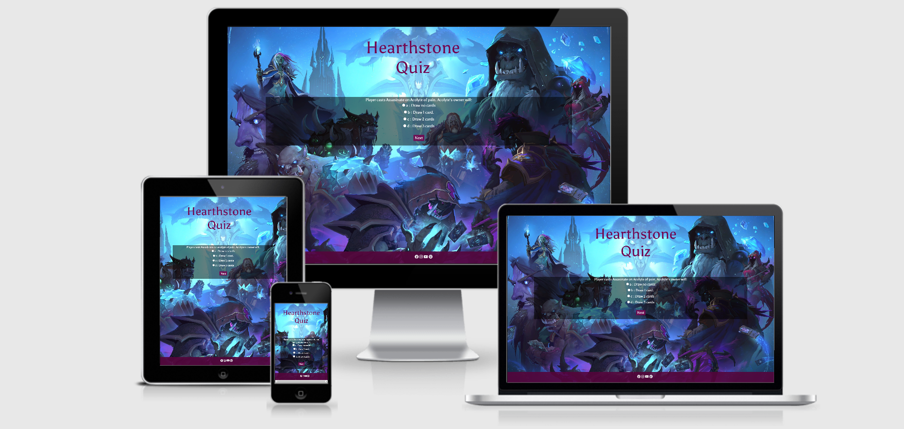
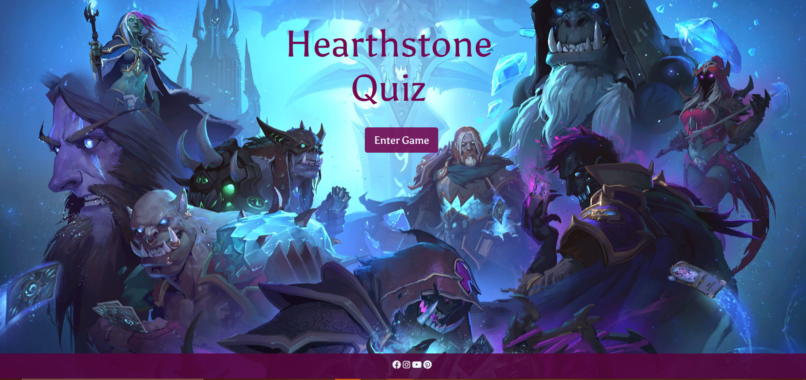
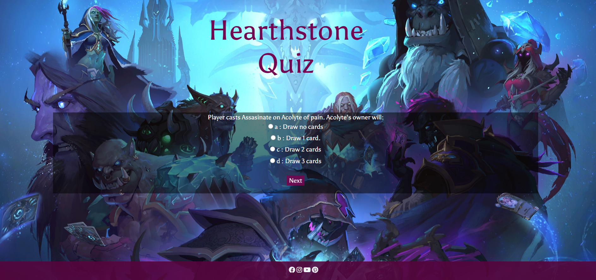
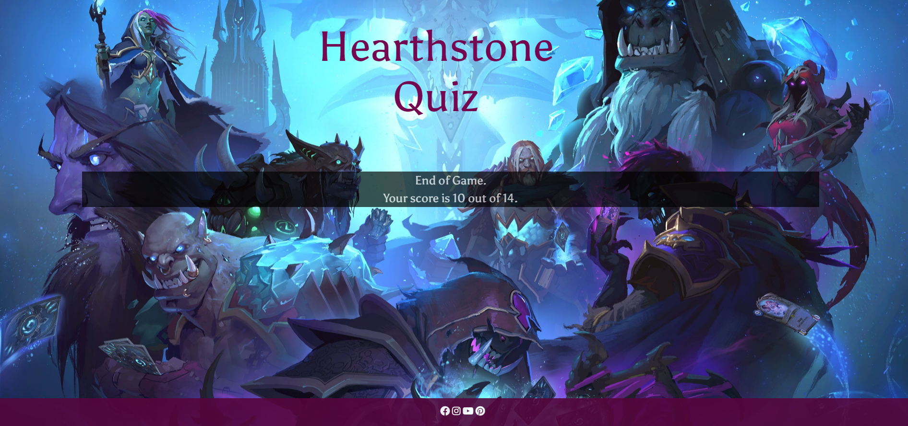
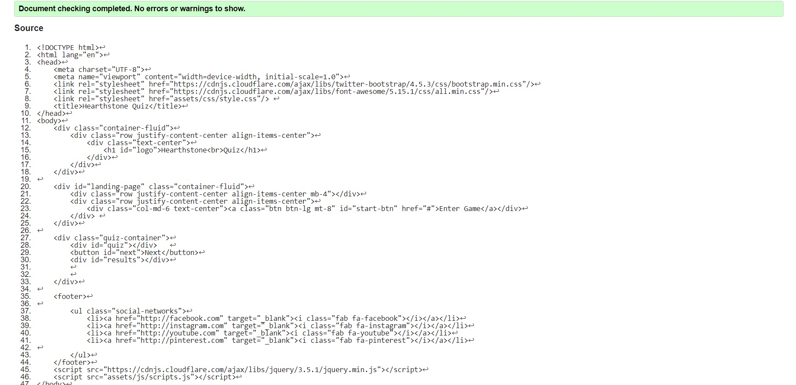
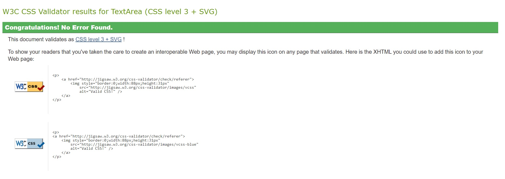

# [Hearthstone Quiz](https://hearthstone.gamepedia.com/Hearthstone_Wiki)

For my second milesone project, I have decided to remake a short, concise Hearthstone quiz. The purpose of the quiz is to test your knowledge about the game (be it cards or heroes).
Though, at the moment, the project does not look the way I initially wanted it, it sums up the general idea. 

**A little bit about the game ...**

Hearthstone is a fast-paced strategy card game that's easy to learn and massively fun.

The game allows you to earn gold, card packs and dust. Gold can be used to buy card packs, play in the arena or buy solo adventures. Card packs are always full of random cards that you can collect and use to craft new decks. Dust can be used to create any card you want!

Game modes : 

**Single Player Adventures** – these are where you play against the computer in a themed environment. Every time a new Hearthstone season begins a full expansion of cards comes out and usually a new single player adventure along with it.

**Casual Play** – you play against a randomly selected opponent.

**Ranked Play** – you play against a randomly selected opponent. The more games you win the higher you rank, until you eventually rank Legend. The higher the rank the more rewards you get each month (like extra gold, dust, and cards)

**Tavern Brawl** – This is a weekly event where players get to play special matches (sometimes against other players, sometimes against the computer), with special rules.

Hero cards represent the players in the game. They govern how much health the players have remaining, what cards they can put in their deck, and detail the style of the deck.

Players start with a hero from a particular class that then determines what other cards can be utilized or included in the deck. For example, a hero with the rogue class would allow you to play a Rogue's signature attack, Backstab.

During the game, standard heroes can use emotes (6 basic emotes) during the match as a minimal form of communication with the other player.

Each hero has a Class, and a Hero Power (an ability that can be used once per turn for a cost).

When your opponent's hero's Health is reduced to 0, you win the game.

## Table of Content
  * [UX (User Experience)](#ux--user-experience-)
    + [User Stories](#user-stories)
    + [User Goals](#user-goals)
    + [Design](#design) 
    + [Color Scheme](#color-scheme) 
    + [Typography](#typography)
  * [Wireframes](#wireframes)    
  * [Features](#features)
    + [Existing Features](#existing-features)
    + [Future Features](#future-features) 
  * [Technologies Used](#technologies-used)
  * [Testing](#testing)
  * [Deployment](#deployment)
  * [Credits](#credits)
        

# User Experience (UX) #
## User Stories
* As a new Hearthstone player, I would like to test my newly acquired knowledge. 

* As an old Hearthstone player, I would like to try the quiz out of fun.

### User Goals
 * Find out if the user has basic Hearthstone knowledge.
 * Have a little fun.

 ### User Requirements and Expectations ###
 * Intuitive layout. 
 * Easy to use. 
 * Receive the correct result at the end of the quiz.

 
 
 
## Design
### Colour Scheme

The two main colours used are a dark shade of magenta (#730851) and white.

Color scheme taken from [Color Hex](https://www.colorhexa.com/730851).

### Typography
 * I used [Asul](https://fonts.google.com/specimen/Asul#standard-styles) for the text, because it gave me a World of Warcraft/Hearthstone-y vibe. It was the only font that merely resembled the game fonts, was available and was easy to read. 

## Wireframes

For my wireframes, I used [Marvel Wireframes](https://marvelapp.com/)
They are roughly sketched out and can be found at the following [link](https://marvelapp.com/project/5409869/design/75801397).

## Features
### Existing Features:

1.   Short, fun and instructive quiz which displays the results quickly.  
2.   Social Media/Enter Game and Next buttons
 

### Future Features: 
 1. Adding a timer 

 2. Changing the background image for every question, since it would probably make the game more appealing.
 
 3. Aligning the answers.

 4. Creating the possibility for the user to enter their nickname. 

## Technologies Used
### Languages Used

1. [HTML5](https://en.wikipedia.org/wiki/HTML) 

2. [CSS3](https://en.wikipedia.org/wiki/CSS)

3. [Javascript](https://en.wikipedia.org/wiki/JavaScript)

4. [Bootstrap](https://en.wikipedia.org/wiki/Bootstrap_(front-end_framework))

### Frameworks, Libraries & Programs Used  

- [jQuery](https://jquery.com/)

- [JSHint](https://jshint.com/)

- [Google Fonts](https://fonts.google.com/)

- [Font Awesome](https://fontawesome.com/)

- [Gitpod](https://gitpod.io/)

- [GitHub](https://github.com/)

- [Marvel](https://marvelapp.com/)

## **Testing**
### **Testing**

The [W3C Markup Validator](https://validator.w3.org/) and [W3C CSS Validator Services](https://jigsaw.w3.org/css-validator/) were used to validate the project to ensure there were no syntax errors.

 

[JSHint](https://jshint.com/) was used for the JS file. 

### **Automated Testing** 
For the automated testing, I have used Lighthouse. Results can be found in the **Testing Folder**.

### **Further Testing**
The Website was tested on Google Chrome, Microsoft Edge and Opera browsers.

The website was viewed on a variety of devices such as Laptop, Huawei P30 Pro, Huawei P20 Pro and Samsung S9.

A large amount of testing was done to ensure that the quiz was linking correctly. Part of this testing was done in Chrome Developer Tools, to ensure that the responsiveness was acting the way it should. I have also used the console to make sure that I do not get any internal errors for the deployed project (even though it was the case before). 

### **Fixed Bugs**
 1. Footer not sticking to the bottom - fixed in CSS by using the "position : fixed" and "bottom : 0" elements.
 2. Footer appearing on top of last question, without the possibility of scrolling further down - fixed by setting body margin. 
 3. Footer not being wide enough to fit the screen - fixed by setting the width ti 100%.
 4. Background image zooming in after entering the game. Cover property sizes the whole image perfectly on the landing page, but not on quiz page (either zooms in or repeats). Tried fixing with "No repeat" but it leaves a white space above the footer - fixed by adding no-repeat center fixed and background-size: cover properties. 
 5. Questions not wrapping properly - fixed by modifying margin to percentages instead of pixels. 
 6. Vertically aligned the Hearthstone Quiz logo. but it moved to the left - fixed by removing the display table value. 
 7. Quiz not moving forward when clicking Next - fixed by correcting "if" statement (myQuestions instead of questions).
 8. Console displaying wrong question ID compared to what appears on the live site - fixed by  modifying the ID of the question and the total number of questions. 
 9. Total score not appearing after the last question - fixed by modifying the total number of questions (14 in total, but starting from 0).
 10. When the correct answer is being clicked on, it is being recognized as a wrong answer. When clicking "Next", the console implies that the question has been answered correctly - fixed by sorting out the selected/correct answers. 
 11. Next button appearing on landing page - fixed by using the hide/show methods. 

### **Known Bugs**
1. First question is doubled, but not interfering with the final score. Need to remove one instance of the question.
2. Footer icons not centering in mobile view. 

## **Deployment** ##
The project was deployed to GitHub Pages using the following steps:

Log in to GitHub and locate the GitHub Repository.

At the top of the Repository, locate the "Settings" Button on the menu.

Scroll down the Settings page until you locate the "GitHub Pages" Section.

Under "Source", click the dropdown called "None" and select "Master Branch".

Click "Save" and refresh the page.

Scroll back down through the page to locate the now published site link in the "GitHub Pages" section.

## **Credits**

### **Content**
- The quiz information (Q/A) has been taken from [Youtube](https://www.youtube.com/watch?v=N3unf-eGS9Q).
- General Javascript quiz info was take from [here](https://www.sitepoint.com/simple-javascript-quiz/?fbclid=IwAR3Yth6dYZJ6rtB9fxBHaajmibEV_H-HryAeYDh0vXDJvAjxW0KN7LbHQJs) and [here](https://codereview.stackexchange.com/questions/119804/answer-checking-script).
- I have also used info from [W3Schools]https://www.w3schools.com/ for clearing the air with certain problems I have faced. 
- The info for the upper part of the Readme.md was taken from [Hearthstone Wiki](https://hearthstone.fandom.com/wiki/Hero) and [What is Hearthstone](https://www.atablefullofjoy.com/what-is-hearthstone/#:~:text=Hearthstone%20is%20a%20fun%2C%20free,to%20learn%20and%20massively%20fun.).
- Inpiration for the README.md came from [Awkale.me](http://awkale.me/user-story-best-practice/), [Markdown Tutorial](https://commonmark.org/help/tutorial/), [Code Institute Solutions](https://github.com/Code-Institute-Solutions/SampleREADME)/[Anna Greaves](https://www.youtube.com/watch?v=7BteidgLAyM&amp;feature=youtu.be). 
### **Media**
- The background image was taken from [here](https://wallpaperaccess.com/full/973179.jpg).  

### **Acknowledgements**
- Shout-out to my mentor, Ignatius Ukwuoma, without whom I wouldn't have been able to do, let alone finish this challenging milestone project.

**Sidenote:** 
    The project itself is rudimentary, mostly because of my limited Javascript knowledge. Personally, I could not assimilate the information properly, so I focused on creating a simple but functional quiz, without extra features like a timer or form/modal.   