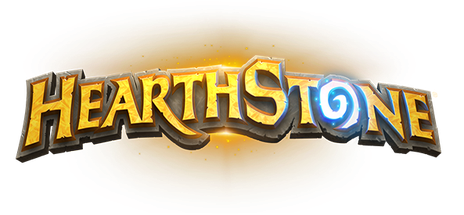

# Hearthstone Quiz

Hearthstone is a fast-paced strategy card game that's easy to learn and massively fun.

The game allows you to earn gold, card packs and dust. Gold can be used to buy card packs, play in the arena or buy solo adventures. Card packs are always full of random cards that you can collect and use to craft new decks. Dust can be used to create any card you want!

Game modes : 

**Single Player Adventures** – these are where you play against the computer in a themed environment. Every time a new Hearthstone season begins a full expansion of cards comes out and usually a new single player adventure along with it.

**Casual Play** – you play against a randomly selected opponent.

**Ranked Play** – you play against a randomly selected opponent. The more games you win the higher you rank, until you eventually rank Legend. The higher the rank the more rewards you get each month (like extra gold, dust, and cards)

**Tavern Brawl** – This is a weekly event where players get to play special matches (sometimes against other players, sometimes against the computer), with special rules.

[https://www.atablefullofjoy.com/what-is-hearthstone/#:~:text=Hearthstone%20is%20a%20fun%2C%20free,to%20learn%20and%20massively%20fun.]

Hero cards represent the players in the game. They govern how much health the players have remaining, what cards they can put in their deck, and detail the style of the deck.

Players start with a hero from a particular class that then determines what other cards can be utilized or included in the deck. For example, a hero with the rogue class would allow you to play a Rogue's signature attack, Backstab.

During the game, standard heroes can use emotes (6 basic emotes) during the match as a minimal form of communication with the other player.

Each hero has a Class, and a Hero Power (an ability that can be used once per turn for a cost).

When your opponent's hero's Health is reduced to 0, you win the game.

[https://hearthstone.fandom.com/wiki/Hero]

# User Experience (UX)
## User Stories
a. As a former World of Warcraft player, I would like to dive in the Hearthstone realm and relive the narrative.

b. As a Hearthstone player, I would like to try the quiz out of fun.

### Visitor Goals

## Design
### Colour Scheme

The two main colours used are a dark shade of magenta (#730851) and white.

Color scheme taken from [Scheme Color](https://www.schemecolor.com/hearthstone-logo-colors.php).

### Typography

## Wireframes
[Marvel Wireframe](https://marvelapp.com/project/5409869/design/75801397)
## Features
Existing Features

1.   
2.  
3. 
4. 

## Technologies Used
### Languages Used

1. [HTML5](https://en.wikipedia.org/wiki/HTML) 

2. [CSS3](https://en.wikipedia.org/wiki/CSS)

3. [Javascript](https://en.wikipedia.org/wiki/JavaScript)

4. [Bootstrap](https://en.wikipedia.org/wiki/Bootstrap_(front-end_framework))

### Frameworks, Libraries & Programs Used  

- [jQuery](https://jquery.com/)

- [JSHint](https://jshint.com/)

- [Google Fonts](https://fonts.google.com/)

- [Font Awesome](https://fontawesome.com/)

- [Gitpod](https://gitpod.io/)

- [GitHub](https://github.com/)

- [Marvel](https://marvelapp.com/)

## **Testing**
### **Testing**

The [W3C Markup Validator](https://validator.w3.org/) and [W3C CSS Validator Services](https://jigsaw.w3.org/css-validator/validator) were used to validate the project to ensure there were no syntax errors.

Also, [JSHint](https://jshint.com/) was used for the Javascript file. 

### **Automated Testing**
For the automated testing, I have used Lighthouse. Results can be found in the **Testing Folder**.

### **Further Testing**
The Website was tested on Google Chrome, Microsoft Edge and Opera browsers.

The website was viewed on a variety of devices such as Laptop, Huawei P30 Pro, Huawei P20 Pro and Samsung S9.

A large amount of testing was done to ensure that all pages were linking correctly.

### **Fixed Bugs**
 1. Footer not sticking to the bottom - fixed in CSS by using the "position : fixed" and "bottom : 0" elements.
 2. Footer appearing on top of last question, without the possibility of scrolling further down - fixed by setting body margin. 
 3. Footer not being wide enough to fit the screen - fixed by setting the width ti 100%.
 4. Background image zooming in after entering the game. Cover property sizes the whole image perfectly on the landing page, but not on quiz page (either zooms in or repeats). Tried fixing with "No repeat" but it leaves a white space above the footer - fixed by adding no-repeat center fixed and background-size: cover properties. 
 5. Questions not wrapping properly - fixed by modifying margin to percentages instead of pixels. 
 6. Vertically aligned the Hearthstone Quiz logo. but it moved to the left - fixed by removing the display table value. 
 7. Quiz not moving forward when clicking Next - fixed by correcting "if" statement (myQuestions instead of questions).
 8. Console displaying wrong question ID compared to what appears on the live site - fixed by  modifying the ID of the question and the total number of questions. 
 9. Total score not appearing after the last question - modified the total number of questions (14 in total, but starting from 0).
 10. When the correct answer is being clicked on, it is being recognized as a wrong answer. When clicking "Next", the console implies that the question has been answered correctly. 

### **Known Bugs**
1. First question is doubled, but not interfering with the final score. Need to remove one instance of the question.
2. 

## **Deployment**
The project was deployed to GitHub Pages using the following steps:

Log in to GitHub and locate the GitHub Repository.

At the top of the Repository, locate the "Settings" Button on the menu.

Scroll down the Settings page until you locate the "GitHub Pages" Section.

Under "Source", click the dropdown called "None" and select "Master Branch".

Click "Save" and refresh the page.

Scroll back down through the page to locate the now published site link in the "GitHub Pages" section.

## **Credits**

### **Content**
The quiz information (Q/A) has been taken from [Youtube](https://www.youtube.com/watch?v=N3unf-eGS9Q)

### **Acknowledgements**
